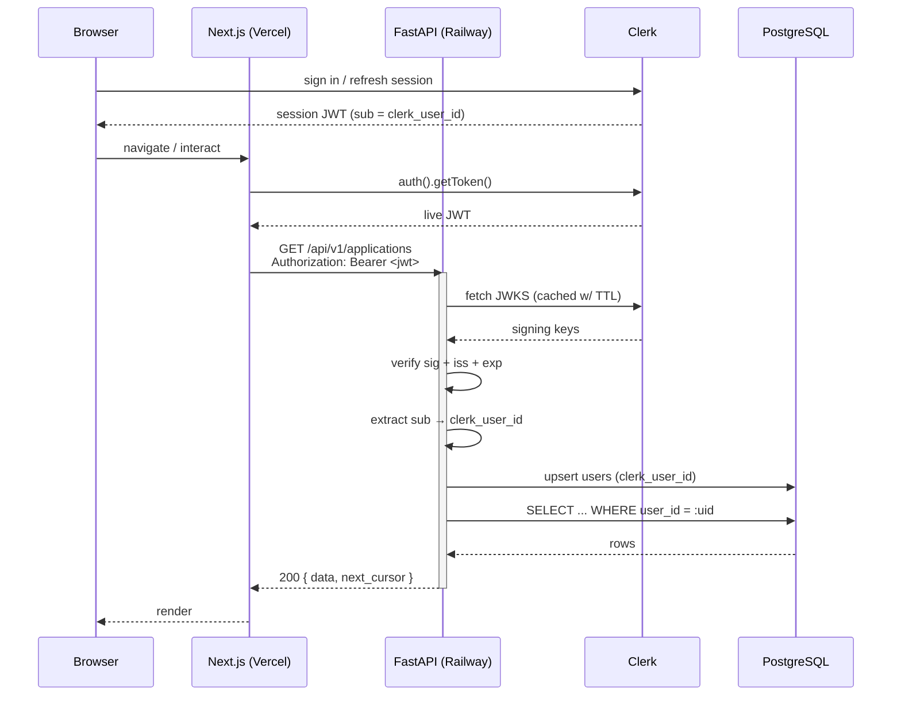

> Living document — kept up to date as CareerOS evolves. Last updated: 2026-07-08.

# CareerOS — Architecture

CareerOS is a modern Job Application Tracker for software engineers — a multi-tenant SaaS web app where each user's data (applications, contacts, documents, pipeline stages) is fully isolated. The v1 surface is a single product with per-user data isolation; organizations, teams, and billing are intentionally deferred (see [ROADMAP.md](./ROADMAP.md)).

This document describes the production architecture: a pnpm-managed Next.js 15 frontend on Vercel, a uv-managed FastAPI backend on Railway, a shared PostgreSQL 16 database, Clerk for authentication, and Firebase Storage for user files. It is the authoritative reference for layout, layering, and cross-cutting behavior and should be read alongside [PRODUCT.md](./PRODUCT.md), [DATABASE.md](./DATABASE.md), [API.md](./API.md), [UI_GUIDELINES.md](./UI_GUIDELINES.md), and [ROADMAP.md](./ROADMAP.md).

---

## System Overview

CareerOS is a single-repository (monorepo) system composed of three runtime tiers — a browser-side React client, a Next.js application layer, and a FastAPI application layer — backed by PostgreSQL for transactional data and Firebase Storage for binary files. Clerk is the identity provider and is trusted by both the frontend (session management) and the backend (JWT verification against published JWKS). The FastAPI service is the canonical API: it owns all business rules, data access, and multi-tenant scoping. Next.js is a thin client that renders UI and proxies authenticated calls to FastAPI.

```mermaid
flowchart LR
    subgraph Client["Client"]
        Browser["Browser (React Server + Client Components)"]
    end

    subgraph Edge["Edge / Hosting"]
        Vercel["Next.js 15 (Vercel)"]
    end

    subgraph API["API Tier"]
        FastAPI["FastAPI (Railway)"]
    end

    subgraph Data["Data Tier"]
        Postgres[("PostgreSQL 16 (Railway plugin)")]
        Firebase[("Firebase Storage (files)")]
    end

    subgraph Identity["Identity"]
        Clerk["Clerk (AuthN + JWT issuer)"]
    end

    Browser -->|HTTPS| Vercel
    Vercel -->|Bearer JWT| FastAPI
    FastAPI -->|async SQL: asyncpg| Postgres
    FastAPI -->|signed URLs / object reads| Firebase
    Browser <-->|OAuth / session| Clerk
    FastAPI -->|verify JWT vs JWKS| Clerk
    Vercel -->|@clerk/nextjs middleware| Clerk

    classDef store fill:#eef2ff,stroke:#4f46e5,color:#312e81
    classDef idp fill:#fff7ed,stroke:#ea580c,color:#7c2d12
    class Postgres,Firebase store
    class Clerk idp
```

The flow of trust is one-directional: Clerk issues a short-lived session JWT, the browser hands it to Next.js, Next.js forwards it as a `Bearer` token to FastAPI, and FastAPI cryptographically verifies it against Clerk's rotating JWKS before any database work. No business data ever flows through Next.js server-side stores; it is streamed straight back to the browser from FastAPI.

---

## High-Level Decisions

| Decision | Choice | Rationale |
|---|---|---|
| Repository shape | Monorepo (single git repo, `backend/` + `frontend/` + `infra/` + `docs/`) | Atomic cross-stack changes (schema + API + UI), one PR per feature, shared CI gating, simpler issue tracking. Cost is enforced separation via lint/CI rather than repo boundaries. |
| Frontend framework | Next.js 15 (App Router) | RSC reduces client JS, file-based routing, first-class Vercel DX, mature middleware for Clerk gating, future SSR for analytics without a rewrite. |
| Frontend language | TypeScript (strict) | Catch contract drift against `API.md` at compile time; `tsc --noEmit` is a CI gate. |
| Frontend styling | TailwindCSS + shadcn/ui | Utility-first consistency, owned component source (no opaque dependency), theming aligned with [UI_GUIDELINES.md](./UI_GUIDELINES.md). |
| Frontend package manager | **pnpm** | Disk-efficient hardlinks, strict peer-dep resolution (avoids phantom deps), fast installs in CI. |
| Backend framework | FastAPI | Async-native, dependency injection that cleanly expresses `get_current_user`/`get_db`, automatic OpenAPI for [API.md](./API.md), strong typing via Pydantic v2. |
| Backend ORM | SQLAlchemy 2 **async** (`asyncpg` driver) | Non-blocking I/O under concurrent requests; 2.0-style `select()` + typed Mappers; mature Alembic migration story. |
| Backend package manager | **uv** | 10–100× faster than pip/poetry, deterministic lockfile (`uv.lock`), single tool for venv + deps + run. |
| Database | PostgreSQL 16 | Mature relational core, native `gen_random_uuid()`, `tstzrange`/JSONB for future flexibility, enums for finite sets, strong `pgcrypto`/`pg_trgm` ecosystem. |
| Primary keys | UUID v4 (`gen_random_uuid()`) | Globally unique, no central sequence bottleneck, safe to generate client-side / offline, no enumeration of sequential ids. |
| Migrations | Alembic (async `env.py`) | Versioned, reviewable schema changes; Railway runs `alembic upgrade head` as a release command before new code receives traffic. |
| Auth provider | **Clerk** (JWT, verified against JWKS) | Drop-in `<ClerkProvider>` + middleware, hosted JWKS = no shared secret, rotation handled by Clerk, `sub` claim maps 1:1 to our `users.clerk_user_id`. |
| API pattern | **Approach A — FastAPI is canonical API**; Next.js is a thin client | One source of truth for business rules and authz; avoids duplicating services in two runtimes. BFF (Approach B) is opt-in for SSR-heavy routes later (see Trade-offs). |
| File storage | Firebase Storage | Mature SDK, signed URLs that expire, generous free tier, decouples binary lifecycle from Postgres backups. |
| Local dev | `docker compose` (db + backend + frontend) | Parity with prod runtime, one command to boot, hot reload via volume mounts; no local Postgres install required. |
| Environments | `local` / `staging` / `production` via `ENV` | Explicit promotion path; config validated fail-fast on boot (pydantic-settings backend, zod frontend). |
| Lint/format | ESLint flat + Prettier (FE); Ruff + mypy (BE); Husky + lint-staged at root | Uniform style without bikeshedding; per-glob staged lint keeps commits fast. |
| CI | GitHub Actions, path-filtered | `frontend-ci.yml` only runs on `frontend/**`, `backend-ci.yml` only on `backend/**` (+ Postgres service container), `docker-build.yml` builds both Dockerfiles on PR. Keeps PR feedback fast and relevant. |
| Deploy | Frontend → Vercel; Backend + Postgres → Railway | Vercel = best Next.js DX and edge network; Railway = Docker-native, single-region colocated with its Postgres plugin for low-latency async queries. |

---

## Component Responsibilities

### Next.js Frontend
Owns the **user experience**: routing, rendering (RSC + client islands), client-side validation (zod), optimistic UI, and Clerk session bootstrap. It obtains the session JWT via `auth().getToken()` and forwards it as `Authorization: Bearer <jwt>` to FastAPI. The frontend **never** owns business rules, never writes raw SQL, and never makes authorization decisions beyond hiding/showing UI. Feature modules under `frontend/src/features/<domain>/` collocate a feature's components, hooks, stores, and zod schemas. UI primitives come from shadcn/ui under `components/ui/`; composed components live under `components/`. See [UI_GUIDELINES.md](./UI_GUIDELINES.md) for the design system.

### FastAPI API
Owns **all business rules and data access**. Layered as `routes → services → repositories → models` (see [Backend Layering](#backend-layering)). Responsibilities: authenticate the caller (Clerk JWKS), authorize every read/write against the caller's `user_id`, enforce validation (Pydantic v2 on the edge), orchestrate transactions, emit structured logs, and return RFC 7807 errors. The app is constructed via a factory in `main.py` that wires lifespan, middleware, and routers. Versioned under `/api/v1`.

### Data Layer (Repositories / Services / Models)
- **Models** — SQLAlchemy 2 ORM entities, one file per table under `models/`. They declare columns, constraints (using a shared naming convention), UUID PKs, timestamp mixins, and Postgres enums for finite sets. Pipeline stages are stored as **data** (rows), not enums, so users can reorder/renumber them.
- **Repositories** — the only layer permitted to write SQL. Each repository owns one aggregate and **every** query method accepts a `user_id` and scopes by it. No service or route touches `AsyncSession` directly except via a repository.
- **Services** — orchestrate use cases: call repositories, enforce cross-entity invariants, wrap multi-statement work in a transaction, and return Pydantic DTOs. Services are runtime-agnostic (no HTTP objects) so they unit-test cleanly.

See [DATABASE.md](./DATABASE.md) for the full schema and [API.md](./API.md) for the HTTP surface each service backs.

### Clerk
External identity provider. Issues session JWTs to the browser, publishes rotating signing keys at its JWKS endpoint, and provides the `sub` claim (the Clerk user id) that CareerOS uses as the stable external key into `users.clerk_user_id`. Clerk never sees CareerOS business data; CareerOS never sees Clerk passwords.

### Firebase Storage
Holds binary user content — résumés, cover letters, attachments. FastAPI mints short-lived signed URLs on demand and hands them to the browser; the browser uploads/downloads directly. Postgres stores only metadata (path, mime, size, sha) keyed to the owning `user_id`. See [DATABASE.md](./DATABASE.md).

### PostgreSQL
The system of record for all transactional data. Owns referential integrity, per-user row isolation (enforced by query scoping, reinforced by indexes that always lead with `user_id`), UUID generation, enum constraints, and timestamps. One logical database per environment.

---

## Request Lifecycle

A typical authenticated read (e.g., "list my applications") flows as follows:

1. The browser holds a Clerk session. On route entry, Next.js middleware (`@clerk/nextjs`) confirms the session is valid and refreshes the JWT if needed.
2. A client component (or RSC `fetch`) calls a feature hook, which calls `lib/api-client` with the credentials.
3. `api-client` obtains the live token via `auth().getToken()` and issues `GET /api/v1/applications?cursor=...` with `Authorization: Bearer <jwt>`.
4. FastAPI's middleware chain runs (CORS, request-id, error envelope, structured logging).
5. The route handler depends on `get_current_user`:
   - Parses the `Bearer` token.
   - Resolves the signing key from Clerk JWKS (cached in-process with a TTL; refetches on `kid` miss).
   - Verifies signature + `iss` + `exp` + `azp`/audience.
   - Extracts `sub` → `clerk_user_id`, **upserts** the local `users` row (idempotent), and returns the `User` ORM object.
6. The route handler depends on `get_db`, yielding a per-request `AsyncSession`.
7. The route calls `applications_service.list(user, cursor, limit)`.
8. The service calls `ApplicationsRepository.list(session, user_id, cursor, limit)`, which emits a single `SELECT ... WHERE user_id = :user_id AND ...` query.
9. Rows map to Pydantic DTOs and the service returns a cursor-paginated envelope.
10. FastAPI serializes to JSON; the response returns to the browser with the standard envelope.



Writes follow the same path through `get_current_user` and `get_db`; the service wraps the repository mutations in a single `AsyncSession` transaction so a failed multi-step write rolls back atomically.

---

## Authentication & Authorization

### Authentication (who you are)
Clerk is the sole identity provider. The browser authenticates with Clerk directly; CareerOS never handles credentials. The session JWT (RS256) is forwarded to FastAPI as a `Bearer` token. FastAPI verifies it via `get_current_user`:

- **JWKS retrieval & caching.** Signing keys are fetched from Clerk's well-known JWKS URL and cached in-process with a TTL. A cache miss on `kid` triggers an immediate refetch so key rotation is picked up without a restart.
- **Claim validation.** Signature, `iss` (must equal the configured Clerk issuer), `exp`, and audience/`azp` are all checked. Any failure raises an RFC 7807 `401`.
- **Subject mapping.** The `sub` claim is the Clerk user id. It is treated as an immutable external key and stored in `users.clerk_user_id` (unique index).
- **Local user upsert.** On every authenticated request the backend does an idempotent `INSERT ... ON CONFLICT (clerk_user_id) DO UPDATE/NOTHING` so a Clerk user always has a corresponding local `users` row keyed by `clerk_user_id`, with a UUID primary key of its own. The returned `User` (with our internal `id`) is what everything downstream uses.

### Authorization (what you can do)
CareerOS is single-tenant-per-user in v1: there are no orgs, no sharing, no roles beyond "owner of one's own data." Isolation is enforced **defense-in-depth**:

1. **Repository scoping (primary).** Every repository method takes a `user_id` and every query includes `WHERE user_id = :user_id`. There is no unscoped repository method.
2. **Index discipline.** Every multi-tenant table's indexes lead with `user_id`, so the scope filter is also the hot path. See [DATABASE.md](./DATABASE.md).
3. **No cross-user identifiers exposed.** UUID PKs make object enumeration infeasible; even so, every lookup by id is coupled with a `user_id` predicate — knowing an id does not grant access.
4. **Service-layer guards.** Services re-check ownership before destructive operations and reject mismatches with `403`.

### Token refresh & rotation
The browser refreshes the Clerk session transparently; `auth().getToken()` always returns a fresh-enough JWT. Backend JWKS caching plus `kid`-miss refetch handles Clerk signing-key rotation with no deploy. There is no long-lived CareerOS-issued token in v1.

---

## Backend Layering

```
HTTP request
   │
   ▼
api/v1/routes/*.py        thin handlers: parse + validate, call service, shape response
   │
   ▼
services/*.py             use-case orchestration: transactions, invariants, DTO mapping
   │
   ▼
repositories/*.py         data access: owns SQL, owns user_id scoping
   │
   ▼
models/*.py               SQLAlchemy 2 ORM entities (columns, constraints, mixins)
```

**Routes** are intentionally boring. They take already-validated Pydantic DTOs (FastAPI validates on the edge), call one service method, and map the result to an HTTP response. They contain no business logic and no SQL. Keeping them thin means OpenAPI (which feeds [API.md](./API.md)) stays a faithful contract.

**Services** are where business rules live. They receive the `User`, repositories, and (if needed) external clients; they open transactions, enforce cross-entity invariants, and return DTOs. They never import `fastapi` types, so they are trivial to unit-test with a fake repository.

**Repositories** are the only SQL authors. Each repository is scoped to one aggregate root and exposes intent-revealing methods (`list_for_user`, `get_for_user`, `create`, `soft_delete`). They always receive `user_id` and always scope by it — this is the seam where tenant isolation physically happens.

**Models** declare structure: columns, types, constraints (via a shared naming convention so Alembic produces deterministic constraint names), UUID PKs, timestamp mixins, soft-delete mixins where relevant, and Postgres enums for stable finite sets. They contain no behavior beyond what the ORM requires.

This separation yields single-responsibility modules, fast targeted tests (service tests with fakes, repository tests against a real Postgres in CI), and a clear place to look when a feature changes.

---

## Data Flow Patterns

### Pagination — cursor-based
List endpoints are **cursor-paginated**, never offset-paginated. The cursor is an opaque, signed value encoding `(sort_key, id)`. Requests take `?cursor=<token>&limit=<1..100>` and responses return `{ data: [...], next_cursor: "<token>" | null }`. Cursor pagination is stable under concurrent inserts, cheap on large tables (especially with the `(user_id, sort_key)` index), and avoids the cost of `OFFSET`.

### Error handling — RFC 7807
All errors (4xx/5xx) use the `application/problem+json` content type with `type`, `title`, `status`, `detail`, and `instance` fields, plus an optional `errors` array for field-level validation failures. Validation errors from Pydantic are translated into `422` problem documents with per-field details. A single exception-to-problem mapping layer (in middleware, not per-route) guarantees consistency. Request ids are propagated so logs and error responses share a correlation key.

### Validation — edge-in, edge-out
- **Backend (authoritative):** Pydantic v2 schemas validate every request body and serialize every response. This is the source of truth for [API.md](./API.md).
- **Frontend (UX):** zod schemas (collocated in each feature module, and derived from the same shapes used by `api-client`) give instant field-level feedback. They are a UX optimization, never an authority — the server always re-validates.

### Files
Binary uploads/resumes flow through signed URLs: FastAPI mints a short-lived Firebase Storage signed URL for a `user_id`-prefixed object key, the browser uploads directly, then the browser posts the resulting metadata to a FastAPI endpoint that records the row in Postgres with the owning `user_id`.

---

## Cross-Cutting Concerns

### Logging
Structured JSON logs from FastAPI (per-request fields: `request_id`, `user_id`, `route`, `method`, `status`, `latency_ms`, `env`). PII is never logged; tokens and credentials are redacted by a logging filter. Log level is config-driven (`DEBUG` local, `INFO` staging/prod). Frontend logs are best-effort and do not transmit secrets.

### Configuration & Environments
Three environments — `local`, `staging`, `production` — selected by the `ENV` variable. Backend config is centralized in a pydantic-settings `Settings` class loaded from environment variables with a fail-fast validator (missing required vars = process exits on boot). Frontend config is validated by a zod schema at module load. Every environment has a committed `.env.example` documenting required variables; real secrets live only in Vercel/Railway.

### Error Handling
As above — RFC 7807 problem+json with a centralized mapper. Unhandled exceptions become opaque `500` problem documents with a `request_id` for support correlation; full tracebacks go to logs only, never to clients.

### Security
- **CORS:** strict allowlist (Vercel preview domains + the prod apex), credentials allowed, methods restricted to what the API uses.
- **Input validation:** Pydantic on the edge for every route; zod on the client; no stringly-typed params.
- **Rate limiting:** per-IP and per-`user_id` limits at the FastAPI edge (configurable per environment) to protect auth-bound endpoints and future AI features.
- **Secrets:** injected via Railway/Vercel, never committed; `.env.example` contains keys only, never values; Husky/lint-staged cannot leak them but a pre-commit secret scan is enabled.
- **Tenant isolation:** enforced at the repository layer on every query (see [Authentication & Authorization](#authentication--authorization)).
- **Transport:** HTTPS everywhere; HSTS on prod apex.

### Observability (future)
v1 ships with structured logs and `request_id` correlation. Tracing/metrics (OpenTelemetry → a managed backend) and uptime checks are roadmap items; the codebase is structured so a single middleware addition wires them in without touching routes. See [ROADMAP.md](./ROADMAP.md).

---

## Local Development

`docker compose up` from the repo root brings up three services that mirror production topology:

- **`db`** — `postgres:16` with a named volume for persistence and a healthcheck the other services wait on.
- **`backend`** — FastAPI under `uvicorn --reload` with `backend/src` mounted for hot reload; runs Alembic migrations on boot.
- **`frontend`** — Next.js dev server with `frontend/src` mounted for fast refresh.

Each service reads its own `.env` (root `.env` for compose wiring, `backend/.env` and `frontend/.env` for app secrets, all mirrored by their `.env.example`). Clerk and Firebase credentials point at dedicated **development** instances. Database migrations and seed data are applied automatically; destructive resets are an explicit `docker compose down -v && docker compose up`. There is no need to install Postgres, Node, or Python locally — only Docker.

---

## Deployment Topology

```
        ┌──────────────┐
        │   Vercel     │   Next.js 15 frontend (edge network)
        │  (frontend)  │   builds from frontend/Dockerfile-less Vercel pipeline
        └──────┬───────┘
               │ HTTPS, Bearer JWT
        ┌──────▼───────┐
        │   Railway    │   FastAPI container (backend/Dockerfile, multi-stage)
        │  (backend)   │   single region, colocated with DB
        └──────┬───────┘
               │ asyncpg
        ┌──────▼───────┐
        │   Railway    │   PostgreSQL 16 plugin
        │ (Postgres)   │   same region as backend
        └──────────────┘
```

- **Frontend → Vercel:** auto-deploys from `main` (production) and every PR (preview). Build runs ESLint, Prettier check, and `tsc --noEmit`.
- **Backend → Railway:** builds `backend/Dockerfile` (multi-stage: `uv` install → slim runtime image). Deploy is gated by CI green.
- **Postgres → Railway plugin:** same region as the backend for sub-millisecond query latency; automated nightly backups retained per environment.
- **Migrations:** Railway runs `alembic upgrade head` as a **release command** — migrations apply *before* the new revision receives traffic, so a deploy either fully migrates or fully rolls back.
- **Promotion:** `local` (compose) → `staging` (auto-deploy from `main` to staging envs) → `production` (promoted manually after staging smoke tests). Each environment has isolated Vercel/Railway projects and isolated Clerk + Firebase projects.

---

## Scalability Notes

- **Stateless API.** FastAPI holds no per-user session state; JWKS keys are cached in-process but otherwise any container can serve any request. Horizontal scaling is a Railway replica count change.
- **Async I/O.** The entire request path — HTTP, ORM, driver — is async (`asyncpg`), so a single worker handles many concurrent waits. This matters most for AI/LLM-bound calls (planned) and file-metadata round trips.
- **Connection pooling.** SQLAlchemy async engine pool sized per replica; Postgres `max_connections` accounts for replicas × pool size + headroom. PgBouncer is a planned addition once replica counts grow.
- **UUID PKs.** Remove the central-sequence write hotspot, enable safe client-side id generation, and keep inserts append-only-friendly across indexes that lead with `user_id`.
- **Per-user indexes.** Because every query is scoped by `user_id`, indexes are designed `(user_id, …)` so the scope filter and the sort/seek collapse into one index scan.
- **Where the bottlenecks will be.** (1) **AI/LLM cost and latency** — the first feature that breaks "fast and cheap"; mitigations planned are request budgeting, response streaming, and per-user rate limits. (2) **File storage** — Firebase egress and object counts; mitigated by signed-URL direct uploads (no proxying through FastAPI) and lifecycle rules. (3) **Large per-user lists** — addressed today by cursor pagination and will be reinforced by background reindexing if any single user's volume grows.

---

## Trade-offs & Future Options

- **Approach A vs. Approach B (BFF).** Today CareerOS uses **Approach A**: FastAPI is the canonical API and Next.js is a thin client that forwards authenticated calls. This keeps business rules, authz, and validation in exactly one place (FastAPI) and avoids running a parallel service layer inside Next.js. We will switch to **Approach B (Next.js as Backend-for-Frontend)** selectively — only for SSR-heavy routes such as a public-facing analytics dashboard or shareable report pages — when the cost of fetching + reshaping from the client becomes real. The seam is `lib/api-client`: replacing direct-to-FastAPI calls with Next.js route handlers that proxy/aggregate is a per-route change, not an architecture change.
- **Organizations & teams.** v1 is per-user only. The schema and the repository-scoping discipline are designed so an `organization_id` (and `memberships`) can be threaded through the same `user_id`-style filter later without rewriting routes — see [ROADMAP.md](./ROADMAP.md).
- **Billing.** Deferred. Clerk metadata + a billing provider (Stripe) can be wired into the existing `get_current_user` upsert path when monetization is introduced.
- **Postgres-only vs. other stores.** We commit to Postgres for all transactional data in v1 (including JSONB for flexible blobs) rather than introducing Redis/Neo4j/etc. early. A dedicated cache or search store is justifiable only when measured latency demands it.
- **Single-region.** v1 runs in one Railway region colocated with its Postgres. Multi-region active-active is explicitly out of scope until usage justifies the consistency complexity.
