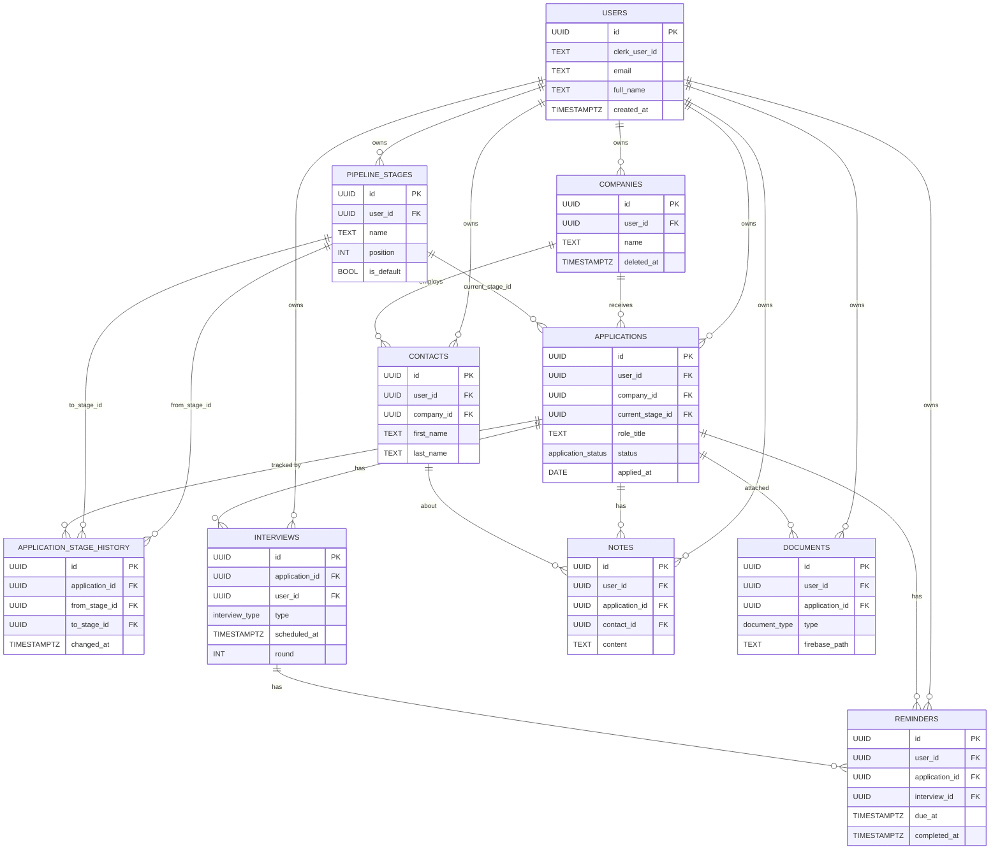

> Living document — kept up to date as CareerOS evolves. Last updated: 2026-07-08.

# CareerOS — Database

This document specifies the complete v1 data model for CareerOS — the schema, conventions, constraints, indexing strategy, and operational policies that govern persistence. It is the canonical reference for anyone touching ORM models, migrations, or queries; application-layer behavior (DTOs, endpoints, services) is covered in [API.md](./API.md) and system structure in [ARCHITECTURE.md](./ARCHITECTURE.md). The model is single-tenant-per-user by design: every content row is owned by exactly one `user_id`, and that invariant is enforced at the repository layer.

## Stack & Tooling

- **PostgreSQL 16** — primary and only datastore in v1. Uses native `gen_random_uuid()` (in core since PG13; no extension required), `TIMESTAMPTZ`, CITEXT-capable collations, and expression indexes.
- **SQLAlchemy 2 async** — declarative ORM with `Mapped` / `mapped_column` typing. All engine and session usage is async via **asyncpg**.
- **Alembic** — schema migrations with an **async `env.py`** (uses `async_engine_from_config`, runs migrations inside `connection.run_sync(context.run_migrations)` under `asyncio.run`). Supports both offline (SQL generation) and online (direct apply) modes.
- **AsyncSession per request** — a single scoped `AsyncSession` is injected per HTTP request; repositories receive it and never open their own sessions.
- **Pydantic v2** — DTOs/schemas live alongside but are strictly separate from ORM models; models never inherit from Pydantic.

## Design Principles

1. **UUID primary keys everywhere.** Every table uses `id UUID PRIMARY KEY DEFAULT gen_random_uuid()`. UUIDs are opaque, URL-safe, unordered (no enumerable IDs), and shard-friendly from day one.
2. **UTC-only timestamps.** All temporal columns are `TIMESTAMPTZ` and stored in UTC. The application never writes local time; presentation layers convert for display.
3. **Soft-delete where history matters.** `SoftDeleteMixin` (`deleted_at TIMESTAMPTZ NULL`) is applied selectively — to entities where losing the row would break analytics, audit trails, or undo flows (companies, applications, contacts, interviews, notes). Audit tables (`application_stage_history`) and pure metadata that is regenerated (`documents`, `reminders`) are hard-managed. Repositories filter `deleted_at IS NULL` by default; only explicitly opted-in queries read tombstoned rows.
4. **Per-user isolation via `user_id`.** Every content table carries a NOT NULL `user_id` FK to `users`. This column is the tenancy boundary and the natural shard key. There are no orgs, teams, or shared rows in v1.
5. **Stable, autogen-friendly naming.** A `naming_convention` dict on `MetaData` makes Alembic autogenerate deterministic names for indexes, constraints, and FKs, so revisions are reviewable and diffs are stable across regenerations.
6. **Pipeline stages are DATA, not an enum.** Users can rename ("Screening" → "Recruiter Call"), reorder, and re-color their funnel stages. Modeling stages as rows in `pipeline_stages` (with `position`) instead of a fixed enum preserves that flexibility. Only truly finite, product-defined sets (application lifecycle, interview format, document kind) are enums.
7. **Layered access.** `models/` define structure only. `repositories/` own all SQL, always scope by `user_id`, and return ORM objects. `services/` compose business logic across repositories and never emit raw SQL. Schemas (Pydantic) handle serialization at the API boundary.

## Naming Conventions

| Element | Convention | Example |
| --- | --- | --- |
| Table | snake_case, **plural** | `pipeline_stages`, `application_stage_history` |
| Column | snake_case | `current_stage_id`, `applied_at` |
| Primary key column | `id` | `id` |
| Foreign key column | `<entity>_id` | `company_id`, `user_id`, `from_stage_id` |
| Join-through / nullable FK | `<entity>_id` (NULL allowed) | `contact_id` on `notes` |
| Boolean column | `is_` / `has_` prefix | `is_default` |
| Timestamp (point in time) | `<verb>_at` | `created_at`, `applied_at`, `due_at`, `completed_at` |
| Index | `ix_<table>_<cols>` | `ix_applications_user_id_status` |
| Unique constraint | `uq_<table>_<cols>` | `uq_pipeline_stages_user_id_position` |
| Foreign key constraint | `fk_<table>_<col>_<referred>` | `fk_applications_company_id_companies` |
| Check constraint | `ck_<table>_<name>` | `ck_reminders_due_at_present` |
| Primary key constraint | `pk_<table>` | `pk_users` |
| Enum type | snake_case singular | `application_status`, `interview_type` |
| Enum value | snake_case | `take_home`, `cover_letter` |

## Common Columns & Mixins

Shared columns are expressed as small SQLAlchemy mixins composed onto each model. This keeps every table consistent and lets repositories rely on a fixed surface for timestamps and soft-delete.

- **`TimestampMixin`** — `created_at` and `updated_at`, both `TIMESTAMPTZ`, NOT NULL, server-default `now()`. `updated_at` is bumped via SQLAlchemy `onupdate=func.now()` (a DB trigger is an acceptable alternative; we use the ORM hook for portability).
- **`SoftDeleteMixin`** — `deleted_at TIMESTAMPTZ NULL`. `NULL` = live; non-null = tombstoned. Applied selectively (see each table).
- **`UUIDPrimaryKey`** — `id UUID PRIMARY KEY DEFAULT gen_random_uuid()`.

Illustrative (not the full codebase — see `models/base.py` for the live definitions):

```python
NAMING_CONVENTION = {
    "ix": "ix_%(table_name)s_%(column_0_N_name)s",
    "uq": "uq_%(table_name)s_%(column_0_N_name)s",
    "ck": "ck_%(table_name)s_%(constraint_name)s",
    "fk": "fk_%(table_name)s_%(column_0_name)s_%(referred_table_name)s",
    "pk": "pk_%(table_name)s",
}

class Base(DeclarativeBase):
    metadata = MetaData(naming_convention=NAMING_CONVENTION)

class TimestampMixin:
    created_at: Mapped[datetime] = mapped_column(
        DateTime(timezone=True), server_default=func.now(), nullable=False,
    )
    updated_at: Mapped[datetime] = mapped_column(
        DateTime(timezone=True), server_default=func.now(),
        onupdate=func.now(), nullable=False,
    )

class SoftDeleteMixin:
    deleted_at: Mapped[datetime | None] = mapped_column(
        DateTime(timezone=True), nullable=True, default=None,
    )

# On each model:
id: Mapped[UUID] = mapped_column(UUID, primary_key=True, server_default=text("gen_random_uuid()"))
```

All times are UTC; the asyncpg driver returns timezone-aware `datetime` objects. `gen_random_uuid()` is supplied by the database, so UUIDs exist before INSERT round-trips.

## Entity Relationship Diagram



## Tables

### users

Local mirror of the Clerk user record; the foreign-key target for every user-owned table and the cache of profile information. Clerk remains the source of truth for identity and authentication; this row exists so relational data can reference a stable local PK and so we can read profile fields without an external call on every request.

| Column | Type | Constraints | Notes |
| --- | --- | --- | --- |
| id | UUID | PK, DEFAULT `gen_random_uuid()` | Local PK; URL-safe |
| clerk_user_id | TEXT | NOT NULL, UNIQUE | Stable link to Clerk identity |
| email | TEXT (or CITEXT) | NOT NULL | Stored lowercased; CITEXT preferred for lookups |
| full_name | TEXT | NULL | Display name, synced from Clerk |
| avatar_url | TEXT | NULL | Profile image URL, synced from Clerk |
| created_at | TIMESTAMPTZ | NOT NULL, DEFAULT `now()` | TimestampMixin |
| updated_at | TIMESTAMPTZ | NOT NULL, DEFAULT `now()`, onupdate `now()` | TimestampMixin |

Indexes: `uq_users_clerk_user_id` (unique).

Notes: No `user_id` column — this table **is** the tenancy root. No soft-delete; account closure is an explicit, hard-cleanup flow described in [Data Integrity & Constraints](#data-integrity--constraints).

### companies

User-managed directory of employers the user is engaging with. Deduplicated so one company record feeds many applications and contacts.

| Column | Type | Constraints | Notes |
| --- | --- | --- | --- |
| id | UUID | PK, DEFAULT `gen_random_uuid()` | |
| user_id | UUID | NOT NULL, FK `users.id` ON DELETE RESTRICT | Owner; tenancy boundary |
| name | TEXT | NOT NULL | |
| website | TEXT | NULL | |
| industry | TEXT | NULL | |
| size | TEXT | NULL | Free-form band, e.g. `"51-200"` |
| location | TEXT | NULL | |
| linkedin_url | TEXT | NULL | |
| notes | TEXT | NULL | Free-text per-company notes |
| created_at | TIMESTAMPTZ | NOT NULL, DEFAULT `now()` | TimestampMixin |
| updated_at | TIMESTAMPTZ | NOT NULL, DEFAULT `now()`, onupdate `now()` | TimestampMixin |
| deleted_at | TIMESTAMPTZ | NULL | SoftDeleteMixin |

Indexes: `ix_companies_user_id`; `uq_companies_user_id_lower_name` UNIQUE on `(user_id, lower(name))` — expression unique index enforcing case-insensitive dedup per user.

### pipeline_stages

The user's configurable funnel stages. Modeled as data (rows) rather than an enum so users can rename, reorder, and re-color stages without a migration.

| Column | Type | Constraints | Notes |
| --- | --- | --- | --- |
| id | UUID | PK, DEFAULT `gen_random_uuid()` | |
| user_id | UUID | NOT NULL, FK `users.id` ON DELETE RESTRICT | Owner |
| name | TEXT | NOT NULL | |
| position | INT | NOT NULL | Board column order; gap-free not required |
| color | TEXT | NULL | UI accent color (e.g. hex) |
| is_default | BOOL | NOT NULL, DEFAULT `FALSE` | Marks the seeded set |
| created_at | TIMESTAMPTZ | NOT NULL, DEFAULT `now()` | TimestampMixin |
| updated_at | TIMESTAMPTZ | NOT NULL, DEFAULT `now()`, onupdate `now()` | TimestampMixin |

Indexes: `ix_pipeline_stages_user_id`; `uq_pipeline_stages_user_id_position` UNIQUE on `(user_id, position)`.

Seed defaults for new users (created by a post-signup hook): **Applied, Screening, Interview, Offer, Accepted, Rejected**, each with `is_default = TRUE` and contiguous `position`.

Notes: NOT soft-deletable in v1 — referenced by `applications.current_stage_id` and by history FKs, so deletion must be a guarded reassignment flow, not a tombstone.

### applications

The atomic unit of the job search: one candidate × one role at one company.

| Column | Type | Constraints | Notes |
| --- | --- | --- | --- |
| id | UUID | PK, DEFAULT `gen_random_uuid()` | |
| user_id | UUID | NOT NULL, FK `users.id` ON DELETE RESTRICT | Owner |
| company_id | UUID | NOT NULL, FK `companies.id` ON DELETE RESTRICT | Hard FK — every app belongs to a company |
| role_title | TEXT | NOT NULL | e.g. `"Senior Backend Engineer"` |
| current_stage_id | UUID | NULL, FK `pipeline_stages.id` ON DELETE RESTRICT | Current funnel position |
| status | `application_status` | NOT NULL, DEFAULT `'active'` | Lifecycle status; **distinct from stage** |
| job_url | TEXT | NULL | Original posting URL |
| job_description | TEXT | NULL | Captured description text |
| source | TEXT | NULL | e.g. `"LinkedIn"`, `"referral"` |
| salary_min | INT | NULL | |
| salary_max | INT | NULL | |
| salary_currency | CHAR(3) | NULL | ISO 4217, e.g. `"USD"` |
| applied_at | DATE | NULL | Date the user applied (no time component) |
| created_at | TIMESTAMPTZ | NOT NULL, DEFAULT `now()` | TimestampMixin |
| updated_at | TIMESTAMPTZ | NOT NULL, DEFAULT `now()`, onupdate `now()` | TimestampMixin |
| deleted_at | TIMESTAMPTZ | NULL | SoftDeleteMixin |

Indexes: `ix_applications_user_id`; `ix_applications_user_id_status`; `ix_applications_user_id_applied_at`; `ix_applications_company_id`; `ix_applications_current_stage_id`.

### application_stage_history

Append-only audit of every stage transition for an application. Powers funnel analytics and the "how did this app move?" timeline. Never soft-deleted; rows are immutable once written.

| Column | Type | Constraints | Notes |
| --- | --- | --- | --- |
| id | UUID | PK, DEFAULT `gen_random_uuid()` | |
| application_id | UUID | NOT NULL, FK `applications.id` ON DELETE CASCADE | Bound to the application |
| from_stage_id | UUID | NULL, FK `pipeline_stages.id` ON DELETE RESTRICT | NULL on the first transition into the pipeline |
| to_stage_id | UUID | NOT NULL, FK `pipeline_stages.id` ON DELETE RESTRICT | New stage |
| changed_at | TIMESTAMPTZ | NOT NULL, DEFAULT `now()` | When the transition occurred |
| note | TEXT | NULL | Optional context |

Indexes: `ix_application_stage_history_application_id`; `ix_application_stage_history_changed_at`.

### contacts

People the user is engaging with — recruiters, hiring managers, interviewers, refs.

| Column | Type | Constraints | Notes |
| --- | --- | --- | --- |
| id | UUID | PK, DEFAULT `gen_random_uuid()` | |
| user_id | UUID | NOT NULL, FK `users.id` ON DELETE RESTRICT | Owner |
| company_id | UUID | NULL, FK `companies.id` ON DELETE RESTRICT | Nullable — a contact may be independent |
| first_name | TEXT | NULL | |
| last_name | TEXT | NULL | |
| email | TEXT | NULL | |
| phone | TEXT | NULL | |
| linkedin_url | TEXT | NULL | |
| role_title | TEXT | NULL | e.g. `"Recruiter"` |
| created_at | TIMESTAMPTZ | NOT NULL, DEFAULT `now()` | TimestampMixin |
| updated_at | TIMESTAMPTZ | NOT NULL, DEFAULT `now()`, onupdate `now()` | TimestampMixin |
| deleted_at | TIMESTAMPTZ | NULL | SoftDeleteMixin |

Indexes: `ix_contacts_user_id`; `ix_contacts_company_id`.

### interviews

Scheduled or completed interview events attached to an application.

| Column | Type | Constraints | Notes |
| --- | --- | --- | --- |
| id | UUID | PK, DEFAULT `gen_random_uuid()` | |
| application_id | UUID | NOT NULL, FK `applications.id` ON DELETE CASCADE | Lives under an application |
| user_id | UUID | NOT NULL, FK `users.id` ON DELETE RESTRICT | Owner; denormalized for direct querying |
| type | `interview_type` | NOT NULL | Format of the interview |
| scheduled_at | TIMESTAMPTZ | NULL | NULL when unscheduled / ad-hoc |
| duration_min | INT | NULL | Estimated length in minutes |
| location | TEXT | NULL | For onsite / phone |
| video_url | TEXT | NULL | For video calls |
| round | INT | NULL | Sequence within the loop, e.g. `2` |
| notes | TEXT | NULL | Prep notes, feedback |
| created_at | TIMESTAMPTZ | NOT NULL, DEFAULT `now()` | TimestampMixin |
| updated_at | TIMESTAMPTZ | NOT NULL, DEFAULT `now()`, onupdate `now()` | TimestampMixin |
| deleted_at | TIMESTAMPTZ | NULL | SoftDeleteMixin |

Indexes: `ix_interviews_user_id_scheduled_at`; `ix_interviews_application_id`.

### notes

Free-text notes attachable to an application, a contact, both, or neither (standalone).

| Column | Type | Constraints | Notes |
| --- | --- | --- | --- |
| id | UUID | PK, DEFAULT `gen_random_uuid()` | |
| user_id | UUID | NOT NULL, FK `users.id` ON DELETE RESTRICT | Owner |
| application_id | UUID | NULL, FK `applications.id` ON DELETE SET NULL | Detaches (not deletes) if app removed |
| contact_id | UUID | NULL, FK `contacts.id` ON DELETE SET NULL | Detaches if contact removed |
| content | TEXT | NOT NULL | Note body |
| created_at | TIMESTAMPTZ | NOT NULL, DEFAULT `now()` | TimestampMixin |
| updated_at | TIMESTAMPTZ | NOT NULL, DEFAULT `now()`, onupdate `now()` | TimestampMixin |
| deleted_at | TIMESTAMPTZ | NULL | SoftDeleteMixin |

Indexes: `ix_notes_application_id`; `ix_notes_user_id_created_at`.

### documents

Metadata for files stored in Firebase Storage. Bytes never live in Postgres — only pointers and metadata.

| Column | Type | Constraints | Notes |
| --- | --- | --- | --- |
| id | UUID | PK, DEFAULT `gen_random_uuid()` | |
| user_id | UUID | NOT NULL, FK `users.id` ON DELETE RESTRICT | Owner |
| application_id | UUID | NULL, FK `applications.id` ON DELETE SET NULL | Optional tailoring target |
| type | `document_type` | NOT NULL | Resume / cover letter / other |
| name | TEXT | NOT NULL | Display name |
| firebase_path | TEXT | NOT NULL | Object path in Firebase Storage |
| mime_type | TEXT | NULL | e.g. `"application/pdf"` |
| size_bytes | BIGINT | NULL | Use BIGINT for large files |
| version | INT | NOT NULL, DEFAULT `1` | Resume variant version |
| created_at | TIMESTAMPTZ | NOT NULL, DEFAULT `now()` | TimestampMixin |
| updated_at | TIMESTAMPTZ | NOT NULL, DEFAULT `now()`, onupdate `now()` | TimestampMixin |

Indexes: `ix_documents_user_id_type`; `ix_documents_application_id`.

Notes: No `deleted_at` — documents are user-owned assets; deletion is a hard delete of the row plus a paired Firebase object cleanup.

### reminders

Time-bound nudges tied to an application and/or an interview.

| Column | Type | Constraints | Notes |
| --- | --- | --- | --- |
| id | UUID | PK, DEFAULT `gen_random_uuid()` | |
| user_id | UUID | NOT NULL, FK `users.id` ON DELETE RESTRICT | Owner |
| application_id | UUID | NULL, FK `applications.id` ON DELETE SET NULL | Detaches if app removed |
| interview_id | UUID | NULL, FK `interviews.id` ON DELETE SET NULL | Detaches if interview removed |
| title | TEXT | NOT NULL | |
| due_at | TIMESTAMPTZ | NOT NULL | When the reminder fires |
| completed_at | TIMESTAMPTZ | NULL | NULL = pending; set = done |
| created_at | TIMESTAMPTZ | NOT NULL, DEFAULT `now()` | TimestampMixin |
| updated_at | TIMESTAMPTZ | NOT NULL, DEFAULT `now()`, onupdate `now()` | TimestampMixin |

Indexes: `ix_reminders_user_id_due_at`; `ix_reminders_user_id_completed_at`.

Notes: No `deleted_at` — reminders are completed, not tombstoned; cleanup is a hard delete after a retention window.

## Enums

Postgres-native enums (`Enum(..., native_enum=True)`). Each enum type is created once via Alembic and referenced by column. Values are stable strings; **never reorder or rename existing values** — only append.

### application_status

Lifecycle status of an application as a whole — independent of its position in the pipeline.

| Value | Meaning |
| --- | --- |
| `active` | In flight; default on creation |
| `archived` | Parked by the user; out of active rotation |
| `rejected` | Closed — candidate-side or company-side rejection |
| `accepted` | Closed — offer accepted |

**Rationale:** Stage (where in the funnel) and status (lifecycle outcome) are orthogonal. An application can be in the "Interview" stage and have status `active`, or in "Offer" with status `rejected` if the offer was declined. Modeling them separately keeps the funnel honest and analytics clean.

### interview_type

The format of an interview event.

| Value | Meaning |
| --- | --- |
| `phone` | Phone screen |
| `video` | Video call |
| `onsite` | In-person at the company |
| `take_home` | Async take-home assignment |
| `offer_call` | Call where an offer is extended/discussed |

**Rationale:** These cover the standard formats an engineer encounters; values drive UI affordances (e.g., show `video_url` for `video`, `location` for `onsite`).

### document_type

Kind of stored document.

| Value | Meaning |
| --- | --- |
| `resume` | Resume variant (may be tailored per application) |
| `cover_letter` | Cover letter draft |
| `other` | Anything else (portfolio, references) |

**Rationale:** Drives the resume-tailoring feature and the documents-by-type grouping in the UI.

## Indexing Strategy

Indexes are driven by the actual query patterns of v1:

- **List-by-user (every list view).** Every content table has a leading `user_id` index (`ix_<table>_user_id`) so paginated "show me my X" queries are index-only on the tenancy key.
- **Filtered board views.** `ix_applications_user_id_status` serves the active/archived/rejected board filters without a re-scan; `ix_applications_current_stage_id` groups applications into columns.
- **Timeline / "applications over time."** `ix_applications_user_id_applied_at` serves the analytics chart of applications by date and any "applied between" range filter.
- **Funnel analytics.** `application_stage_history(application_id)` plus `application_stage_history(changed_at)` support cohort and time-window transition queries ("of apps created in May, what fraction reached Offer by July 1?"). The history table is append-only, so these indexes stay optimal.
- **Upcoming interviews.** `ix_interviews_user_id_scheduled_at` (ascending) serves "my next interviews" (`scheduled_at >= now()`), the most common calendar query.
- **Reminders due.** `ix_reminders_user_id_due_at` serves "what's due now / next" (`completed_at IS NULL AND due_at <= now()`); `ix_reminders_user_id_completed_at` serves the "completed history" view.
- **Cross-entity navigation.** `applications.company_id`, `contacts.company_id`, `interviews.application_id`, `notes.application_id`, `notes.contact_id`, `documents.application_id`, and `application_stage_history.application_id` all have indexes to make parent→child fetches cheap.
- **Documents by type.** `ix_documents_user_id_type` serves the "my resumes" / "my cover letters" grouping used by the tailoring feature.
- **Notes timeline.** `ix_notes_user_id_created_at` serves the reverse-chronological notes feed.

Composite indexes are preferred over single-column indexes wherever the tenancy key is the leading column, so a single index serves both the user-scope filter and the secondary sort.

## Data Integrity & Constraints

### Foreign-key cascade policy

The guiding rule: **`user_id` and tenancy-anchor FKs use `ON DELETE RESTRICT`** so a single dropped user row can never silently cascade-delete a user's entire dataset. Account closure is an explicit, ordered flow. True child rows (data that is meaningless without its parent) cascade; detachable references clear to NULL.

| FK | On parent delete | Rationale |
| --- | --- | --- |
| `<table>.user_id → users.id` (all tables) | **RESTRICT** | Prevent accidental mass deletion; account closure is explicit |
| `applications.company_id → companies.id` | **RESTRICT** | Soft-delete the company instead; never lose applications |
| `applications.current_stage_id → pipeline_stages.id` | **RESTRICT** | Reassign applications off the stage before deleting it |
| `contacts.company_id → companies.id` | **RESTRICT** | Soft-delete the company; contacts survive |
| `application_stage_history.application_id → applications.id` | **CASCADE** | History is meaningless without its application |
| `application_stage_history.from_stage_id → pipeline_stages.id` | **RESTRICT** | Audit integrity; reassign or hide the stage instead |
| `application_stage_history.to_stage_id → pipeline_stages.id` | **RESTRICT** | As above |
| `interviews.application_id → applications.id` | **CASCADE** | Interviews are sub-events of an application |
| `notes.application_id → applications.id` | **SET NULL** | A note may outlive the application it was about |
| `notes.contact_id → contacts.id` | **SET NULL** | A note may survive a contact's deletion |
| `documents.application_id → applications.id` | **SET NULL** | Documents are user-owned assets; detach, don't delete |
| `reminders.application_id → applications.id` | **SET NULL** | A reminder may become standalone |
| `reminders.interview_id → interviews.id` | **SET NULL** | A reminder may survive an interview's deletion |

Because the user-facing entities are soft-deleted, the RESTRICT rules above fire only on hard deletes (admin/cleanup jobs). Soft-deleted rows remain referentially intact.

### Unique constraints

- `users.clerk_user_id` — UNIQUE; one local row per Clerk user.
- `(user_id, lower(name))` on `companies` — case-insensitive dedup per user, via an expression unique index.
- `(user_id, position)` on `pipeline_stages` — two stages cannot share a board position for the same user.

### The `users` ↔ Clerk relationship

Clerk is the source of truth for identity, credentials, and profile fields (`email`, `full_name`, `avatar_url`). The local `users` row is a cache and an FK target. On the first authenticated API call from a Clerk session we don't yet have a row for, the auth middleware **upserts**: `INSERT ... ON CONFLICT (clerk_user_id) DO UPDATE SET email = EXCLUDED.email, full_name = EXCLUDED.full_name, avatar_url = EXCLUDED.avatar_url`. This keeps profile fields fresh on each login without an extra sync job. Sign-out never deletes the row. Account closure is a separate, confirm-gated flow that hard-deletes the user's content (respecting RESTRICT by deleting children first) and then deletes the `users` row — and separately revokes the Clerk user via the Clerk API.

### Other integrity notes

- `application_stage_history` is append-only; repositories expose no UPDATE or DELETE path for it.
- `pipeline_stages.position` gaps are allowed (drag-and-drop reordering renumbers a slice); the unique constraint only forbids collisions.
- `documents.size_bytes` is `BIGINT` to safely represent files larger than 2 GB.
- `salary_currency` is `CHAR(3)` to match ISO 4217 exactly; application-level validation rejects invalid codes.

## Migration Policy (Alembic)

- **One revision per logical change.** A PR that adds a table, an index, and a column ships three revisions if they're independent, or one well-described revision if they're one feature — never a grab-bag.
- **Autogenerate, then review.** `alembic revision --autogenerate` produces a starting point, but autogen misses server defaults, check constraints, expression indexes (e.g. `lower(name)`), and enum management. Every generated revision is read end-to-end before commit.
- **Never edit a merged revision.** Once a revision is on `main` and has run in any shared environment, it is immutable. Corrections ship as a new forward revision.
- **Forward-only in production.** Reversing a migration in prod is a destructive, surprising operation. If a change is wrong, ship a new revision that repairs it. Destructive migrations (drop column, drop table) require a paired backfill/cleanup plan and are flagged for release-window review.
- **Run via Railway release command.** Migrations run as the Railway release step (`alembic upgrade head`) before the new app build becomes primary, so the schema is always ahead of or matched to the running code. Deploying code that needs a new column before that column exists is forbidden — code is backward-compatible with the previous schema for one release.
- **Async `env.py`.** `env.py` builds the engine with `async_engine_from_config(..., dialect=asyncpg)` and runs migrations inside `connection.run_sync(context.run_migrations)` under `asyncio.run`. Both offline (`--sql`) and online modes are supported. The `naming_convention` on `MetaData` guarantees autogen produces the stable names documented above.
- **Enum changes are append-only.** New enum values ship as `ALTER TYPE ... ADD VALUE` inside a revision (cannot run inside a transaction block in older PG — Alembic handles this). Existing values are never renamed or removed in v1.

## Multi-Tenancy Enforcement

CareerOS has exactly one tenancy dimension in v1: the user. Enforcement is layered and redundant:

1. **Schema-level.** Every content table has a NOT NULL `user_id` FK to `users`. There is no path to write a content row without an owner.
2. **Repository-level (the choke point).** All SQL flows through `repositories/`. Every repository method takes a `user_id` parameter and every `SELECT`, `UPDATE`, `DELETE` appends `WHERE <table>.user_id = :user_id`. No repository method exposes an unscoped query; no method accepts "all users." This is the hard boundary — services and routes cannot bypass it because they don't write SQL.
3. **Join-through safety.** When querying child entities via their parent (e.g., interviews via applications), the repository still applies the root `user_id` filter on the child table itself; we never rely on the parent FK alone to enforce isolation. Denormalized `user_id` columns on `interviews`, `notes`, `documents`, and `reminders` exist precisely so each child can be scoped without a join.
4. **Request-level identity.** Clerk identity is resolved to a local `user_id` once per request in an auth dependency; that `user_id` is threaded explicitly into every repository call. There is no global "current user" implicit context that a forgotten filter could silently fall back to.
5. **Review and test.** The rule — **"No query may read or write user-owned data without a `user_id` filter"** — is enforced in code review, and repository tests assert that every query includes the `user_id` bind parameter. A repository method without a `user_id` in its signature is a review blocker.

Cross-user access in v1 is impossible by construction; a bug can leak the wrong user's data only by passing the wrong `user_id`, which is why identity resolution happens exactly once, at the edge.

## Future Considerations

- **Billing (Phase 8).** Subscriptions, plans, invoices, and usage metering are deferred. The current schema is already compatible — adding `plans`, `subscriptions`, `invoices`, and `usage_events` tables keyed on `user_id` will slot in without restructuring existing tables. No v1 column anticipates billing.
- **AI-generation artifacts.** Cover-letter drafts, tailored resumes, and prep-question generation will likely need an `ai_generations` table (keyed by `user_id`, optionally linked to `application_id` / `documents.id`) storing prompt, model, output reference, and metadata. Until the shape is proven, we will prefer nullable FKs plus `JSONB` for evolving AI metadata over committing premature columns.
- **Sharding.** UUID PKs are already shard-friendly, and `user_id` is a natural partition key. If we outgrow a single Postgres instance, partitioning content tables by `user_id` hash (or migrating to a sharded topology) requires no application-visible schema change.
- **Soft-delete garbage collection.** A scheduled job will hard-delete rows whose `deleted_at` is older than the retention window, along with their cascaded children. Retention policy and a compliance review are deferred.
- **Teams and organizations.** Explicitly **out of scope** for v1. Every table, repository, and policy here assumes single-user ownership. Introducing shared workspaces later will be an additive change (a new `organizations` layer above `users`) rather than a rewrite, but it is deliberately not pre-modeled.
- **Search.** Per-user full-text search over companies, applications, and notes is a likely near-term addition; it can be served initially by expression GIN indexes on existing `TEXT` columns and later by a dedicated search index without changing the relational model.
